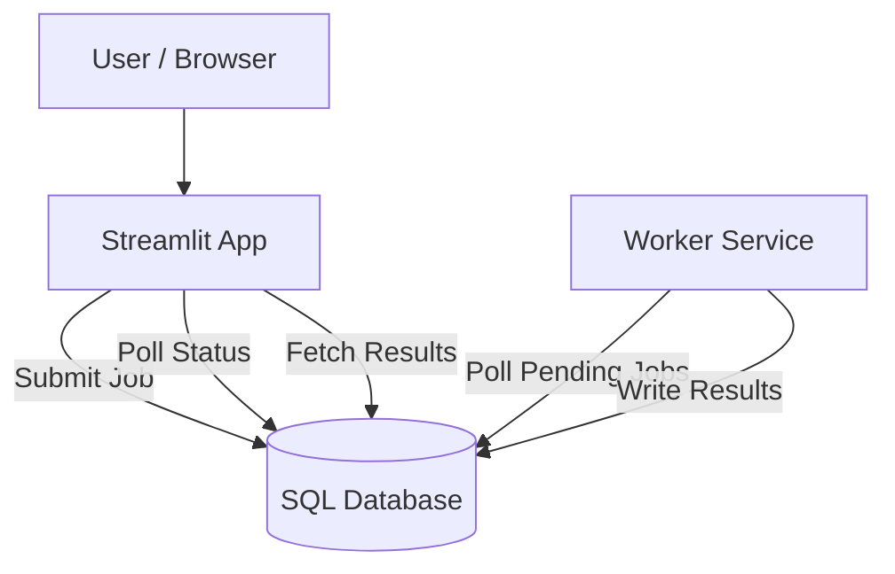

# 🚚 GRASP-CVRP Solver & Parameter Sensitivity Analysis Platform

This repository contains a web-based system for running computational experiments for the Capacitated Vehicle Routing Problem (CVRP).

The system is composed of three main components:

- A **Streamlit web app** for input, configuration, and visualization  
- A **worker service** that executes optimization jobs  
- A **SQL database** that stores jobs and results  

---

## 🏗️ Architecture



**Flow:**

1. The user interacts with the **Streamlit app** in the browser.  
2. The app creates a **job** in the SQL database.  
3. The **worker** polls the database for pending jobs, runs the solver, and writes back results.  
4. The app periodically polls the database and displays the finished solution.

All components are containerized using Docker to ensure consistent execution across environments.

---

REPOSITORY STRUCTURE
```text
.
├── .env.example               # Example environment variables
├── LICENSE
├── README.txt                 # Project documentation
├── benchmarks/                # Benchmark and input instances
│   └── CMT/
├── cvrp_streamlit/            # Core execution and helper modules
├── docker-compose.yml         # Container orchestration (standard setup)
├── docker-compose.dev.yml     # Container orchestration (development setup)
├── queries/
│   └── create_tables.sql      # SQL schema for jobs and results
├── requirements.txt           # Python dependencies
├── solver/
│   ├── Dockerfile             # Worker container definition
│   └── worker.py              # Background worker process
└── streamlit_app/
    ├── Dockerfile             # Streamlit application container
    ├── app.py                 # Streamlit entry point
    ├── ui.py                  # Layout and UI helpers
    └── components/            # Reusable UI components
```

---

CONFIGURATION

Configuration is handled via environment variables. Use .env.example as a template.

Required variables:
- DB_CONNECTION_STRING   SQLAlchemy-compatible connection string
- APP_ACCESS_CODE        Access code required by the Streamlit application

---

RUNNING WITH DOCKER

Development mode (live code):

docker compose -f docker-compose.dev.yml up --build


Standard deployment:

docker compose up -d


----------------------------------------

LOCAL (NON-DOCKER) EXECUTION

pip install -r requirements.txt
python solver/worker.py
streamlit run streamlit_app/app.py --server.port 8502

---

AI DISCLOSURE

This README file was generated with the assistance of an AI-based language model and reviewed by the author.

